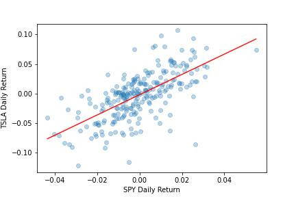
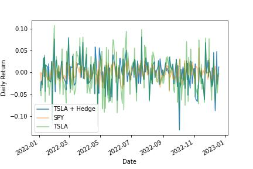

# Beta-hedge a stock portfolio against a benchmark.

Portfolio managers talk a lot about alpha. Alpha is the return they earn above and beyond the market benchmark they’re measured against. Alpha matters because managers are paid to outperform the benchmark.

If alpha is the return they earn above and beyond the market, beta is the return they earn by being exposed to the market.

### Beta hedging concentrates exposure to alpha

Portfolio managers design factor models that tell them how to balance a portfolio to earn alpha. Because alpha is how managers get paid, they only want exposure to their factors. Beta hedging removes the part of returns driven by the market and leaves only the returns driven by the factors.

If this sounds complicated there’s good news: You can hedge beta with the same linear regression you learned in Statistics 101. 

Key Takeaways:
- Get data for stock and benchmark
- Find a portfolio’s alpha and beta
- Hedge beta

---

Libraries used:

numpy

statsmodels

matplotlib

yfinance 

---

## Step 1: Get the data

Get the data. For this example I use TSLA as an example of a stock portfolio. You can use actual portfolio returns instead.
we will use TSLA as the asset and SPY as the benchmark for this example using the pct_change() function on the adjusted close price. 

**Plot the Daily returns**

---

## Step 2: Find the portfolio’s alpha and beta

Linear regression models have an alpha term and one or more beta terms (plus an error). Alpha is the intercept and beta is the slope of the line that minimizes the error between all the points on a scatter plot. This will be clear when you see the chart.

Create a function, Linreg, that accepts two inputs: the independent variable (market returns) and the dependent variable (portfolio returns). 

Inside the function:
add a column of 1s so statsmodels can find the alpha term. 
Run the model 
Return the alpha and beta.

The alpha should be near 0. 
This means that by owning TSLA alone, you’re not beating the benchmark. The beta is 1.71. This means for every 1% the benchmark moves, TSLA moves 1.71% in the same direction.

**Plot the returns and the regression line.**

When SPY’s returns are 0, TSLA’s returns are near 0 too. That’s the intercept (alpha). The slope (beta) is measured by the change in TSLA divided by the change in SPY of the red line which is 1.71.

---

## Step 3: Hedge beta
Because you’re only interested in exposure to the returns generated by owning TSLA, hedge the beta. 
Hedging beta will result in a portfolio with returns close to 0 because alpha is close to 0.

Construct a beta-hedged portfolio.

"be short a number of shares in the market equal to the beta plus TSLA."

Since we’re beta hedged (market neutral) you should expect that the portfolio returns closely resemble that of TSLA. In other words, your exposure is concentrated in your source of alpha.

It looks like the portfolio return follows the asset. 

Run the regression the the portfolio to make sure you removed the beta while keeping the alpha.

